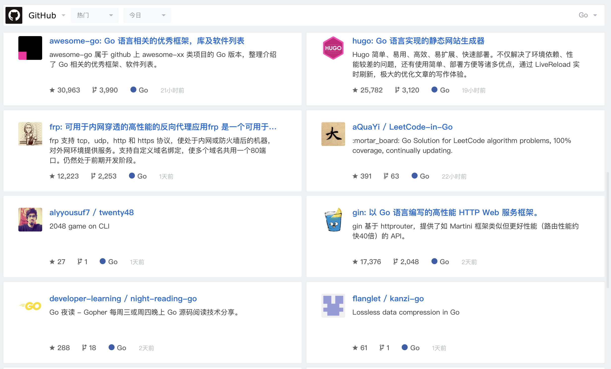
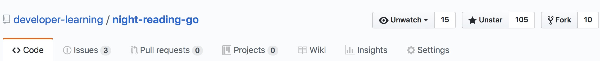
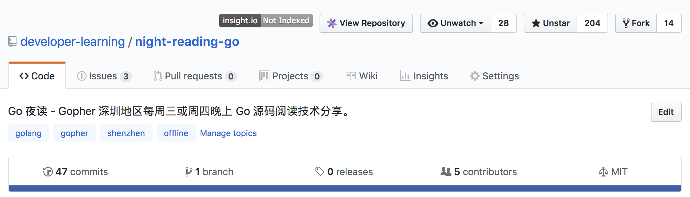
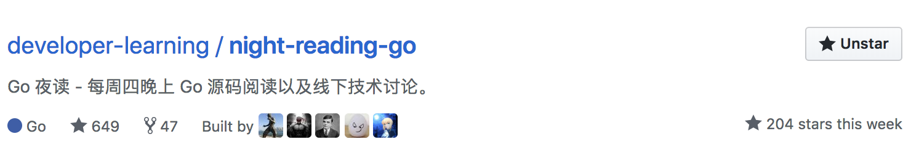

## Go 夜读发展历史

>Go 夜读起源于 Go 语言学习，提升团队 Go 语言技术能力水平，营造一些 Go 语言学习的氛围，但是在公司内部坚持了几周之后，就因为赶项目搁置了。后面项目稍微闲暇之后，就又重启此项目，不过经过这一段时间的中断，我也有了新的思考，为何不将此活动对外，并且以开源项目的方式运作呢？说不定可以帮助到更多的人。所以，你们看到了 Go 夜读项目。

### 第一阶段

1. 在 gocn.io 社区发帖，然后组织了第一批有兴趣的人；
2. 然后是朋友推荐和一些慕名而来人，这个时期完全是自由发展；
3. 因为内容做的还不错，包括微信群的日常讨论的总结；
4. 得到几个大 V 的 star，然后自然引流（appleboy, Windy）；
5. 因为《Go 夜读》线下活动大家都有很多的收获，然后我们还将每期学到的知识进行总结，不久就得到了 [gocn.io](http://gocn.vip) GoCN 每日新闻的推广。

**掘金：**

发展时间：从 2018-03-21 到 2018-06-28

>由于场地以及时间的关系，将《Go 夜读》调整为每周四晚上线上活动（zoom.us）。

----

### 第二阶段

1. 2018-07-12 开始调整为 zoom 线上 Go 夜读活动。

----

### 第三阶段

1. 2018-07-22 发布了一篇文章《Golang 代码质量持续检测》，2018-07-24 得到了几个 Go 群的推广；
2. 2018-07-24 上了 Trending ；
3. 2018-07-24 微信群达到 333 人；
4. 2018-07-26 Star 达到了 650 ；

**Github Trending:**

----

1. 2018-08-06 持续在 Go 语言的 Trending 上；
2. 2018-08-06 微信群达到了 439 人；
3. 2018-08-06 Star 达到了 866 ；

----

1. 2018-08-07 15:05:00 项目得到了[无闻大大](https://github.com/Unknwon)的 Star，直接带来了几十人的 Star，而且还在持续增长中，谢谢大家的认可；
2. 2018-08-07 16:31:00 微信群达到了 445 人；
3. 2018-08-07 16:31:00 Star 达到了 913 ；
4. 2018-08-08 17:08:00 Star 达到了 1067 ；

