# Golang 代码质量持续检测

> Author: Kenny Allen
>
> Email:    kennyallen0520@gmail.com

## 前言

在软件开发过程中，人工检查项目代码中的漏洞和潜在的 BUG 是一件让人十分费神费力的事情，为了解决这一痛点，SonarQube诞生了，它实现了一系列代码自动检测过程，包括命名规范，代码漏洞，代码重复量等。

但是光有 SonarQube 还不能发挥出应有的高效率，一个完整的代码质量持续检测应配合代码仓库(如 gitlab) 和 Jenkins 来共同构建一个自动化过程。

## 环境

* Gitlab、Jenkins、SonarQube 服务都在一台物理机上的Docker中运行

* 网络 (局域网IP：192.168.1.100)

   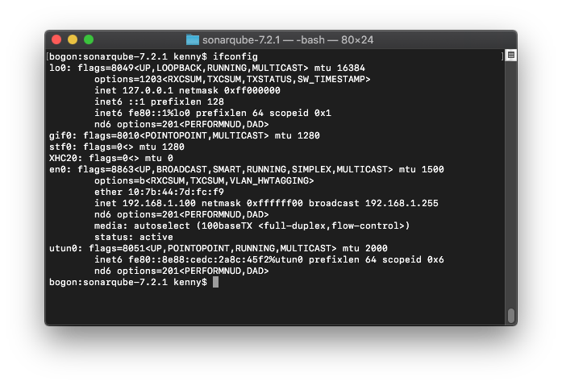

* 主机科学上网代理

   192.168.1.100:1087

   

* 模拟外网访问

   ```shell
   # 修改 hosts 文件，模拟外网访问
   sudo sh -c "echo '192.168.1.100 jenkins.kenny.com\n192.168.1.100 gitlab.kenny.com\n192.168.1.100 sonarqube.kenny.com' >> /etc/hosts"
   ```
   

* 工具集


|  名称  |    版本    |
| :----: | :--------: |
| golang |  go1.10.3  |
| docker | 18.03.1-ce |

## 搭建

接下来，我以一个完整的案例来介绍搭建过程。

### Jenkins

##### 启动服务

```shell
# $jenkins_home 宿主机目录，挂载容器 /var/jenkins_home
# 我的数据卷目录是 ~/.jenkins
export JENKINS_HOME=~/.jenkins
docker run -d --restart=always -p 8080:8080 -p 50000:50000 -v $JENKINS_HOME:/var/jenkins_home --name jenkins jenkins:2.60.3

# 查看 jenkins 日志
docker logs -f jenkins
```

##### 初始化

1. 打开浏览器，访问 http://jenkins.kenny.com:8080

   

   ```shell
   # 在日志中找到管理员密码
   docker logs -f jenkins 
   
   # 或者在 $JENKINS_HOME/secrets/initialAdminPassword 文件中找到管理员密码
   cat $JENKINS_HOME/secrets/initialAdminPassword
   ```

   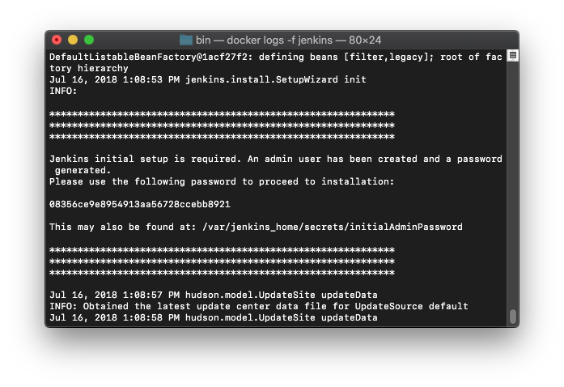

   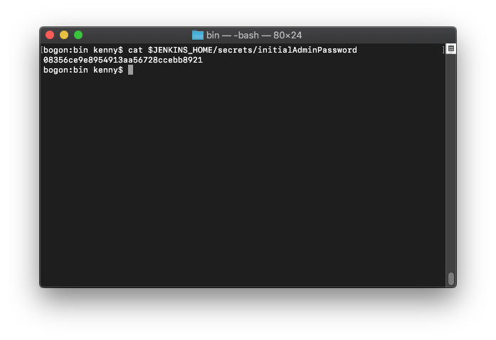

2. 安装推荐插件 (如果你想自定义安装插件，点击 Select plugins to Install)

   

3. 创建管理员账号

   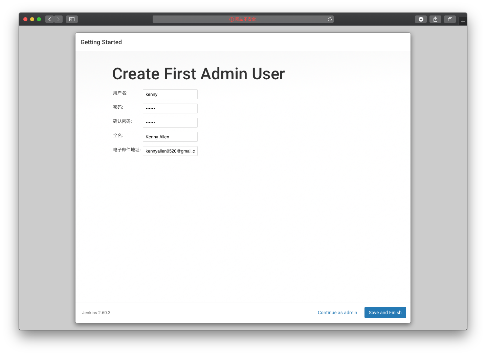

4. 初始化完成

   

### Gitlab

##### 启动服务 (gitlab 集成的服务比较多，因此需要占用较大的内存，官方推荐4GB以上)

```shell
# $gitlab_home 宿主机目录
# 我的数据卷目录是 ~/.gitlab
export GITLAB_HOME=~/.gitlab
docker run -d --restart=always -e 'GITLAB_HOST=gitlab.kenny.com' -p 443:443 -p 80:80 -p 22:22 -v $GITLAB_HOME/conf:/etc/gitlab -v $GITLAB_HOME:/var/opt/gitlab -v $GITLAB_HOME/log:/var/log/gitlab --name gitlab gitlab/gitlab-ce:11.1.0-ce.0

# 查看 gitlab 日志
docker logs -f gitlab
```

##### 初始化

1. 打开浏览器，访问 http://gitlab.kenny.com

   

2. 设置新密码后，使用 root 用户登录

   

   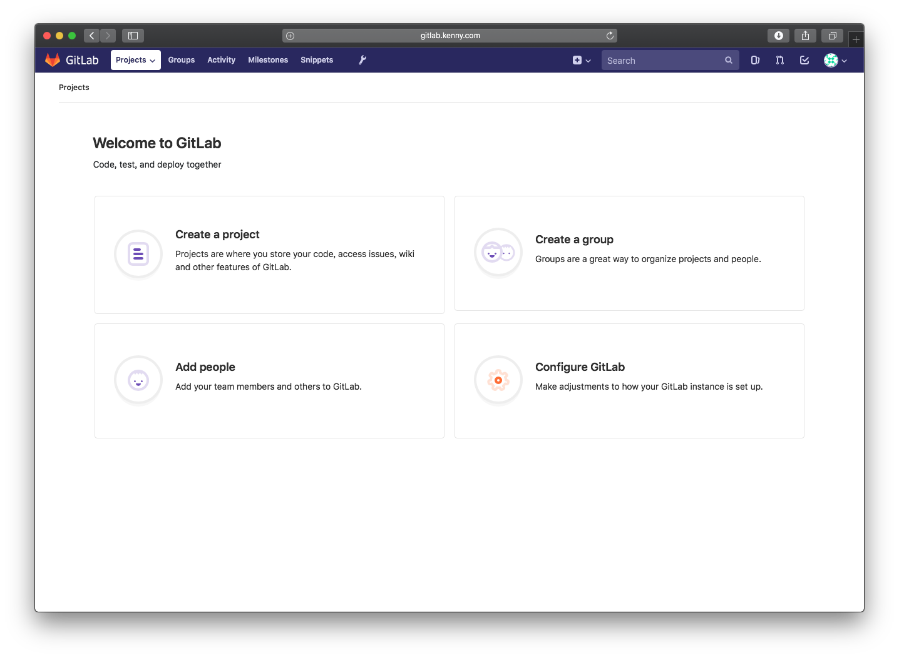

3. 新建 sonarqube 项目组

   

4. 在 sonarqube 项目组下新建 demo 项目

   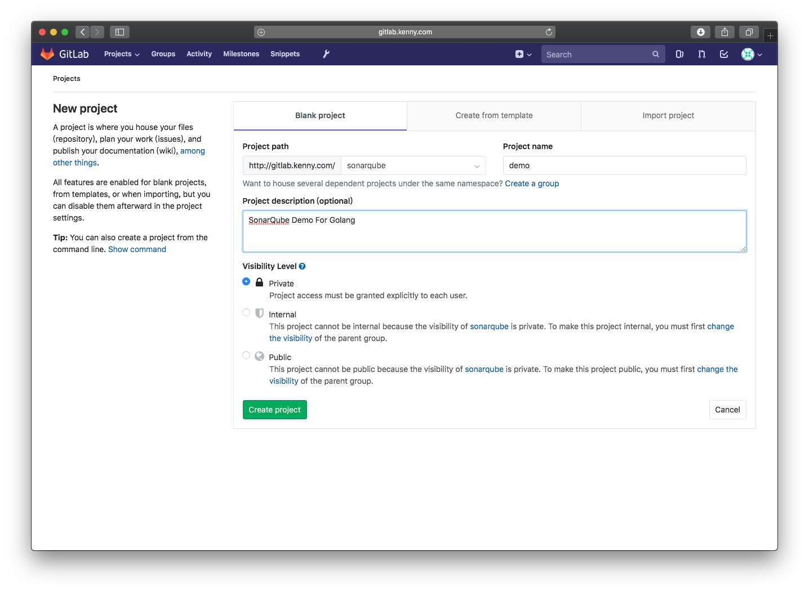
   

5. 添加主机公钥到 Gitlab

   ```shell
   # 生成 rsa 公钥和密钥
   ssh-keygen -t rsa
   
   # 查看并复制公钥
   cat ~/.ssh/id_rsa.pub
   ```

   

   

   访问 http://gitlab.kenny.com/profile/keys  ，将公钥添加至 Gitlab

   

   

6. 将 sonarqube/demo 项目拉至主机的 $GOPATH 下

   ```shell
   # 在 $GOPATH 下创建 gitlab.kenny.com 文件夹
   mkdir -p $GOPATH/src/gitlab.kenny.com && cd $GOPATH/src/gitlab.kenny.com
   
   # clone code
   git clone git@gitlab.kenny.com:sonarqube/demo.git
   ```

### SonarQube

##### 启动服务

```shell
# 由于目前 sonarqube 官方的 Docker images 只有 7.1 版本，不满足 SonarGO 所需 7.2+ 版本，所以我参考7.1 的 Dockerfile 制作了一个 sonarqube 7.2.1 的镜像
# $sonarqube_home 宿主机目录
# 我的数据卷目录是 ~/.sonarqube
export SONARQUBE_HOME=~/.sonarqube
# 正式环境中应启用外部数据库服务来存储必要数据，在启动容器时设置如下JDBC相关参数:
# -e SONARQUBE_JDBC_USERNAME=sonar 
# -e SONARQUBE_JDBC_PASSWORD=sonar 
# -e SONARQUBE_JDBC_URL=jdbc:postgresql://localhost/sonar
docker run -d --restart=always -p 9000:9000 -v $SONARQUBE_HOME:/opt/sonarqube/data --name sonarqube kennyallen/sonarqube:7.2.1

# 查看 sonarqube 日志
docker logs -f sonarqube
```

文件：[Dockerfile](./Dockerfile)、[run.sh](./run.sh)

##### 初始化

1. 打开浏览器，访问 http://sonarqube.kenny.com:9000

   

2. 使用管理员账号登录

   * 账号 admin
   * 密码 admin

   

3. 生成 token (作为远程连接 SonarQube 的标识，只生成一次，记得备份哦)

   admin_token: **74439d5bc557dcc206fa8b1f2f5516e65680bdc8**

   

4. 安装插件 (进入 Administration -> Marketplace)

   

   安装完成后点击重启 SonarQube 服务就OK了


## 集成

* 将 Jenkins、Gitlab 和 SonarQube 有机整合 

### Jenkins 安装插件

1. 点击进入 系统管理 -> 插件管理 -> 可选插件

   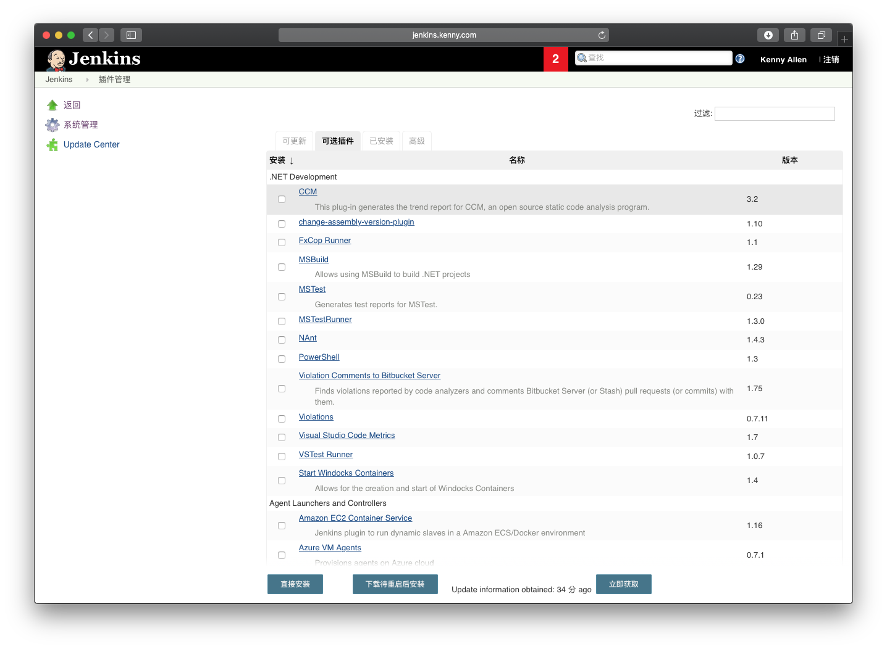

2. 过滤选中 Gitlab、SonarQube Scanner，点击下载待重启后安装

   
   

   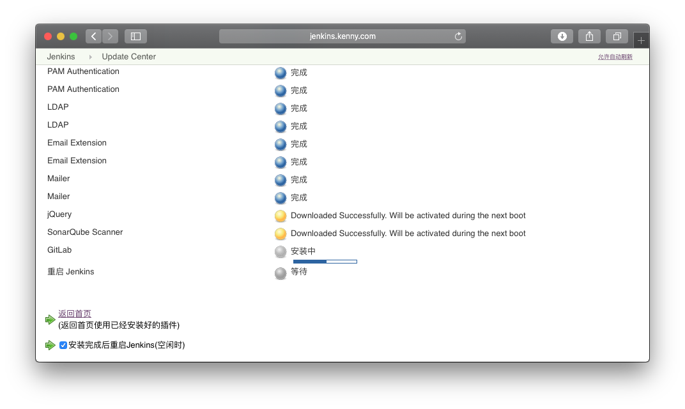

### Jenkins 配置

1. 安装 SonarQube & JDK

   进入 系统管理 -> Global Tool Configuration

   JDK 安装

   ​	勾选我同意 Java SE Development Kit 的许可协议

   ​	点击 Please enter your username/password

   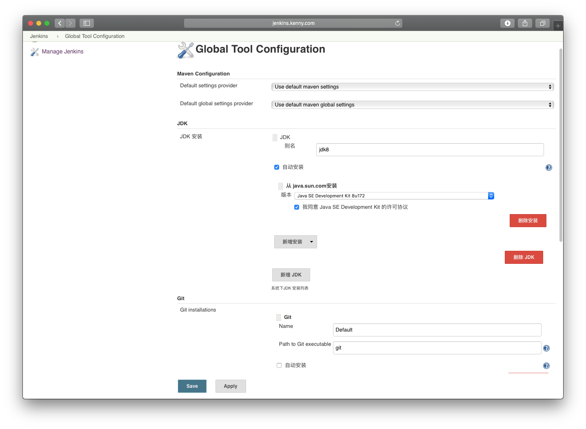

   输入你的 oracle 账号密码

   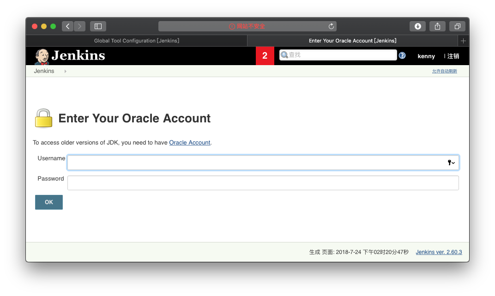

   SonarQube Scanner 安装

   点击保存。

2. SonarQube Server

   进入 系统管理 -> 系统设置

   Add SonarQube servers

   Name 随便填写

   Server URL: http://sonarqube.kenny.com:9000

   Server version: 5.3 or higher

   Server authentication token: 填 SonarQube 初始化时生成的 token

   

3. 取消 Gitlab 授权

   取消选中 Enable authentication for '/project' end-point，保存

   

4. 在 jenkins 容器中安装 golang 环境及工具

   ```shell
   # 在 Jenkins 容器中执行命令
   docker exec -it jenkins /bin/bash
   # 临时设置环境变量
   export GOROOT=$JENKINS_HOME/go
   export GOPATH=$JENKINS_HOME/workspace/go
   export PATH=$PATH:$GOROOT/bin:$GOPATH/bin
   export http_proxy=http://192.168.1.100:1087;export https_proxy=http://192.168.1.100:1087;
   # 进入 jenkins 主目录
   cd $JENKINS_HOME
   # 下载 golang
   wget https://dl.google.com/go/go1.10.3.linux-amd64.tar.gz
   # 解压 golang 包
   tar -xvf  go1.10.3.linux-amd64.tar.gz
   # 删除 golang 包
   rm go1.10.3.linux-amd64.tar.gz
   # 安装必要工具
   # vgo
   go get -u -v golang.org/x/vgo
   # gometalinter
   go get -u -v github.com/alecthomas/gometalinter
   gometalinter --install
   ```

5. 配置邮件通知

   进入 系统管理 -> 系统设置

   Jenkins Location 

   系统管理员邮件地址修改为你自己的邮箱地址，如 wyh3265@163.com

   

   Extend E-mail Notification

   SMTP Server 填写对应的SMTP服务地址，如 smtp.163.com

   点击高级，勾选使用SMTP认证

   用户名 注意不需要加 @xxx.xxx

   密码     填写自己的邮箱密码或授权码

   

   

   Default Triggers 选中 Always

   


### 新建 Jenkins 构建任务

1. 新构建一个自由风格的软件项目

   

2. 使用自定义的工作空间

   点击高级，勾选使用自定义的工作空间

   

   目录：$JENKINS_HOME/workspace/go/src/gitlab.kenny.com/demo

   

3. 源码管理

   Repository URL：http://gitlab.kenny.com/sonarqube/demo

   Credentials：点击Add ，添加凭据 (Gitlab 用户名密码或 SSH登录等方式都可以)

   

4. 构建触发器，选中 

   Build when a change is pushed to GitLab. GitLab webhook URL: http://jenkins.kenny.com:8080/project/demo

   Enabled GitLab triggers 选中 Push Events 和 Accepted Merge Request Events ，表示当 Gitlab 有 push 或 merge 操作发生时触发构建。

   

5. 新建 webhook

   在浏览器中打开 http://gitlab.kenny.com/admin/application_settings (请使用 root 登录)，找到 Outbound requests ，点击 Expand 后，选中  Allow requests to the local network from hooks and services 并保存更改。 (允许本地网络的 githook)

   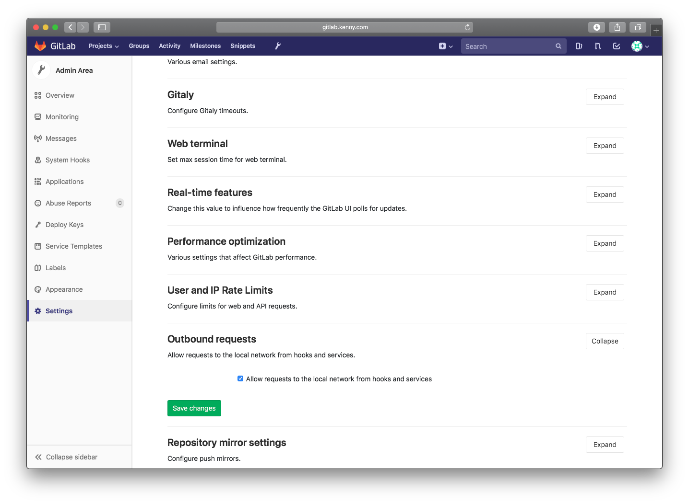

   进入 http://gitlab.kenny.com/sonarqube/demo/settings/integrations

   URL: http://jenkins.kenny.com:8080/project/demo

   SecretToken: 不填

   选中 **Push events**、**Merge request events**

   取消选中 **Enable SSL verification**

   点击 Add web hook

   

6. 增加构建步骤，选中 Execute Shell

   ```shell
   #!/bin/bash
   # 环境变量
   export GOROOT=$JENKINS_HOME/go
   export GOPATH=$JENKINS_HOME/workspace/go
   export PATH=$PATH:$GOROOT/bin:$GOPATH/bin
   export http_proxy=http://192.168.1.100:1087;export https_proxy=http://192.168.1.100:1087;
   
   # 安装依赖
   vgo mod -vendor
   
   # coverage
   go test ./... -coverprofile=coverage.out
   
   # test
   go test ./... -json > report.json
   
   # vet
   go vet ./... 2> govet-report.out
   
   # golint
   golint ./... > golint-report.out
   
   # gometalinter 
   # 执行 gometalinter 会失败,因此加了 || true
   gometalinter ./... > gometalinter-report.out || true
   ```

7. 增加构建步骤，选中 Execute SonarQube Scanner

   Analysis properties

   ```properties
   sonar.projectKey=gitlab.kenny.com
   sonar.projectName=demo
   sonar.sources=.
   sonar.exclusions=**/*_test.go,**/vendor/**
   sonar.tests=.
   sonar.test.inclusions=**/*_test.go
   sonar.test.exclusions=**/vendor/**
   sonar.go.coverage.reportPaths=coverage.out
   sonar.go.tests.reportPaths=report.json
   sonar.go.govet.reportPaths=govet-report.out
   sonar.go.golint.reportPaths=golint-report.out
   sonar.go.gometalinter.reportPaths=gometalinter-report.out
   ```

8. 增加构建后操作，选中 Editable Email Notification

   Project Recipient List  填写接收邮件的Email地址，或使用默认配置

   Default Content  加上 SonarQube URL: http://sonarqube.kenny.com:9000

   

## 测试

```shell
# clone demo 代码
cd $GOPATH/src/gitlab.kenny.com && git clone git@github.com:yuhao5/sonarqube-golang.git && rm -rf demo && mv sonarqube-golang demo && cd demo
# push 代码，触发 Jenkins 任务进行自动构建
git remote add gitlab git@gitlab.kenny.com:sonarqube/demo.git
git push -u gitlab master

# 若 gitlab 仓库地址不是 git@gitlab.kenny.com:sonarqube/demo.git ，请根据以下步骤修改：
docker exec -it gitlab /bin/bash
vim /etc/gitlab/gitlab.rb
# 找到 external_url，修改为 external_url 'http://gitlab.kenny.com'
# 然后执行
gitlab-ctl reconfigure
```


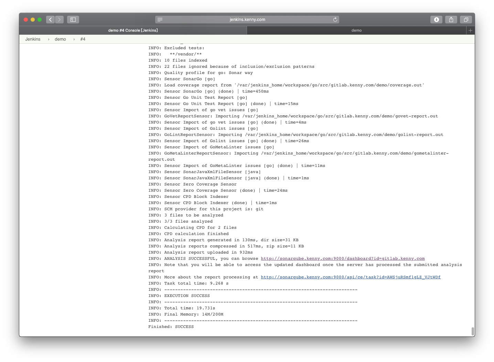

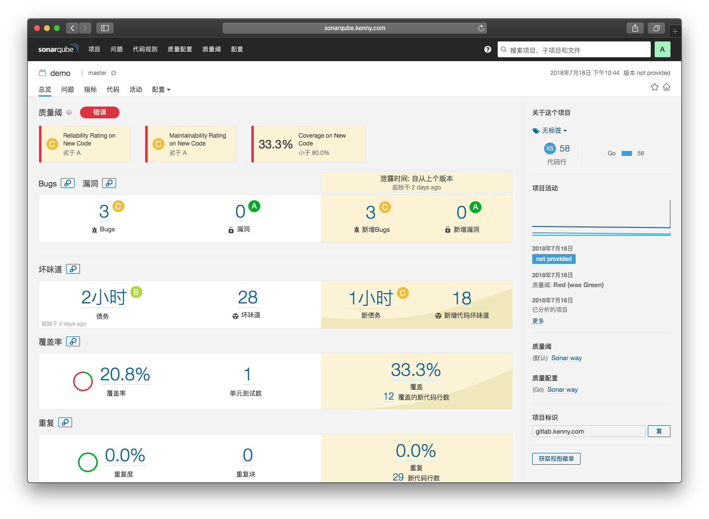


## TODO

1. 解决执行 gometalinter 失败问题
2. Golang 质量标准，规则自定义
3. ...
