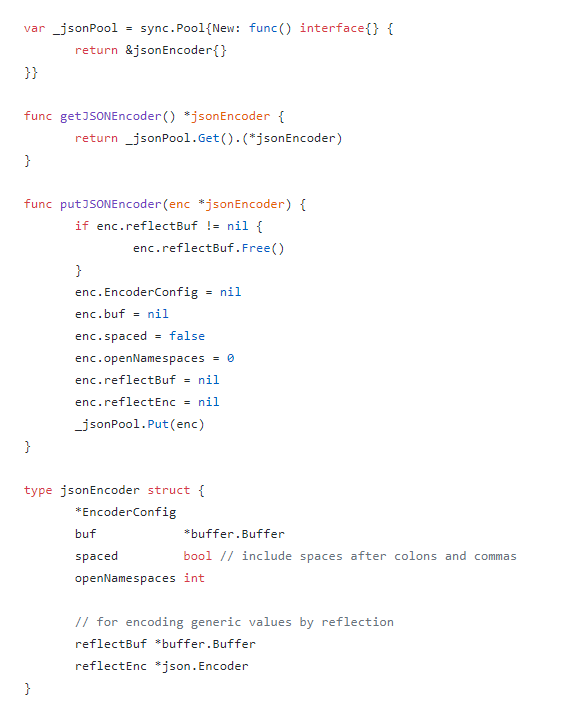

## 2018-08-15

来源：《Go 夜读》微信群

时间：2018-08-15

### 深度 | 从 Go 高性能日志库 zap 看如何实现高性能 Go 组件

>一篇技术文章引发的讨论。

- 我们有一个服务用 logrus 落日志，并发量太高了，直接影响了性能。
- printf 类型字符串格式化的日志格式，不再推荐，现在日志的消费，逐渐从人转向了计算机，结构化的数据和友好的解析方式更重要。---跟 logrus 的作者观点一样，“核心不是性能”。。。

- 我们后面也用 sync.Pool 去优化落日志这一块。（当时因为 logrus 写日志这一块，直接在高并发的时候多开销了10G内存，当时服务总共开销才 15 G内存。后面做了一些优化，用 sync.Pool 提前把日志格式化好，不是用 logrus 里面的 WithFields 之类的，后来对比过 zerolog，但是优化后在 3W 左右的日志并发时，从我们服务器的监控来看，整体没有太大的区别（内存、CPU、服务器的整体速度），所以后面也没有更换 log 库。（原因是在于替换成本也比较高。））

### Echo 里面的 context 也是用 sync.Pool 解决高并发的时候内存占用问题

sync.Pool 的定位不是做类似于连接池的东西，它的用途仅仅是增加对象重用的几率，减少 gc 的负担，而开销方面也不是很便宜的。

[sync.Pool](https://golang.org/pkg/sync/#Pool) 本来就是当做 cache 用的，在 Go 官方文档上已经明确说明了，数据不能保存在 pool 里面，有可能会遇到 GC 回收。
>A Pool is a set of temporary objects that may be individually saved and retrieved.

>Any item stored in the Pool may be removed automatically at any time without notification. If the Pool holds the only reference when this happens, the item might be deallocated.

## 参考

1. [深度 | 从 Go 高性能日志库 zap 看如何实现高性能 Go 组件](https://mp.weixin.qq.com/s/i0bMh_gLLrdnhAEWlF-xDw)
2. [kingsoft-wps-log4go](https://github.com/kingsoft-wps/log4go)
3. [go语言的官方包sync.Pool的实现原理和适用场景](https://blog.csdn.net/yongjian_lian/article/details/42058893)
4. [大幅提升 golang 写日志序列化性能实践](https://my.oschina.net/u/2950272/blog/1785808)
