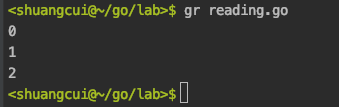
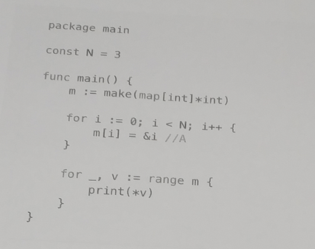
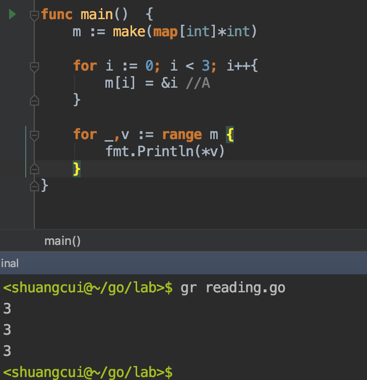
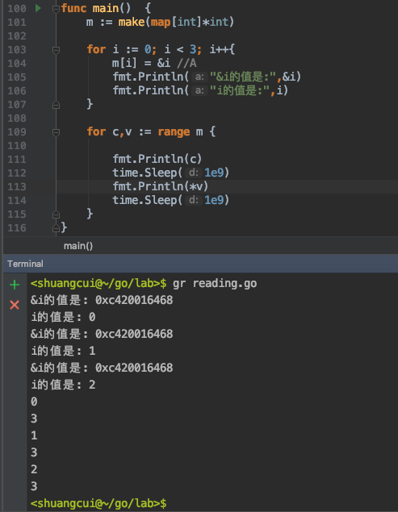
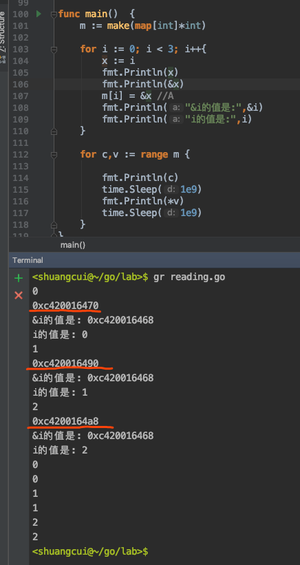

## 1. 以下代码最终的结果是什么?

```go
func main(){
	sli := []int{6,7,8}
	for i := range sli {
		sli = append(sli,666)
		fmt.Println(i)
	}
}

// Output:

```
面试时遇到的一个问题,
这段代码会形成死循环吗?


回来之后试了一下出乎意料:




看上去for循环的次数,在进入循环体前已经确定了,且次数为range后len(sli)

实际上,range为golang的语法糖,其实际执行相当于

```
func main()  {
	sli := []int{6,7,8}
	len_sli := len(sli)
	for index := 0 ; index < len_sli; index++ {
		sli = append(sli,666)
		fmt.Println(index)
	}
}
```

**即在进入循环之前,控制循环次数的这个len_sli参数已经确定;**

**在循环体内对原切片进行append操作,并不会影响len_sli的值**


## 2. 写出以下代码的输出:



初步分析:
- 在第一个循环中为m赋值,键名0,1,2分别对应着键值0,1,2的内存地址
- 在第二个循环中迭代m,每次循环用*取出指针键值对应内存地址里存的值
- 初步分析,结果应该是0,1,2

实际运行:



结果却是3,3,3

- 我们加一下注释代码再来看:


```
func main()  {
   	m := make(map[int]*int)
   
   	for i := 0; i < 3; i++{
   		m[i] = &i //A
   		fmt.Println("&i的值是:",&i)
   		fmt.Println("i的值是:",i)
   	}
   	for c,v := range m {
   		fmt.Println(c)
   		time.Sleep(1e9)
   		fmt.Println(*v)
   		time.Sleep(1e9)
   	}
}
```

结果如下:



即在迭代中m的三个元素的指针相同,都指向了最后一个迭代对象的地址,在此即3的值

- 如果在迭代体中需要访问数组/map元素的指针，那么务必小心.这类bug无形极难轻易寻获


- 改进办法:引入中间变量,如图:




