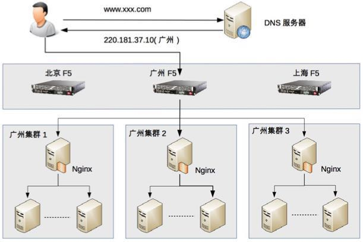

# 分布式架构

_1.Etcd满足了CAP原理中哪两个特性？_

> etcd是高可用的键值存储系统。满足CP原理       

_2.Etcd V2和V3版本的区别？_

> **V2和V3接口不一致，存储不一样，数据互相隔离**
>
>> A.V2是纯内存实现，并未实时将数据写入到磁盘；V3是内存索引(kvindex
: btree) + 后端数据库存储(boltdb: 单机的支持事务的kv存储)       
>> B.V2过期时间只能设置到每个key上，如果多个key要保证生命周期一致则比
较困难；V3过期时间通过lease，可以给每个key设置相同的过期id         
>> C.V2 Watch只能watch某一个key以及子节点(通过参数recursive)，不能
进行多个watch；V3 watch机制支持watch某个固定的key，也支持watch一个范围            
>> D.V2提供http接口；V3通过grpc提供rpc接口       
>
>> [查看资料](http://jolestar.com/etcd-architecture/)

_3.当时选型etcd的考量是啥？和ZK有哪些区别？_

> **相同点**
>
>> 1.应用场景类似: 配置管理，服务注册发现，选主，应用调度，分布式队列，分布式锁。           
>
> **不同点**
>
>> 1.Etcd使用raft协议;Zk使用paxos协议，前者易于理解，方便工程实现。      
>> 2.Etcd相对来说部署方便；Zk的部署、维护、使用比较复杂，需要安装客户端。       
>> 3.Etcd提供http+json，grpc接口，跨平台语言; Zk则需要使用其客户端。       
>> 4.Etcd支持https访问; Zk在这方面缺失。        

_4.服务治理包含哪些？_

> `服务注册和发现`         
> `服务监控`         
> `集群容错`       
> `负载均衡`         

_5.负载均衡分类？_

> 1.DNS负载均衡(地理负载均衡)         
> 2.硬件负载均衡(F5和A10,能支撑200万-800万/秒并发，价格昂贵)           
> 3.软件负载均衡(Nginx和Lvs,nginx支撑5万/秒，LVS支撑80万/秒，价格便宜，
扩展方便)

> 并发访问量大于1000万时可以考虑配合使用

_6.Nginx和Lvs的区别？_

> 1.Nginx工作在第7层，网络的依赖比较小，可以对HTTP应用实施分流策略，比如域名、结构等；Lvs工作在第4层，比较依赖网络环境，可以对几乎所有应用进行负载均衡，包括Web、数据库等          
> 2.Nginx负载能力强，因为其工作方式逻辑非常简单，仅进行请求分发，没有
流量；Lvs负载能力较差，受限于机器的I/O配置(处理流量)        
> 3.Nginx安装，配置及测试相对简单；Lvs的安装、配置及测试所花的时间比较长
>
> [参考资料](https://blog.csdn.net/barnetthe/article/details/48784233)