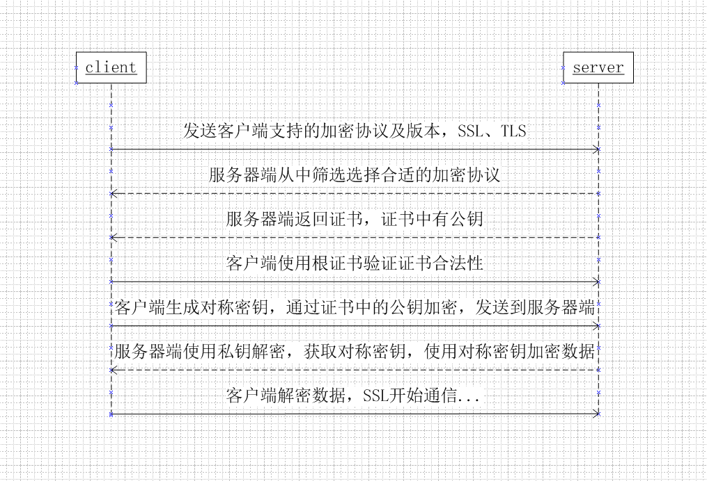

# 网络

_1.tcp三次握手和四次挥手流程示意图？在黑板上画出_

> [查看资料](https://blog.csdn.net/smileiam/article/details/78226816)

_2.客户端在建立异常中发现很多connect reset by peer,你觉得问题出在哪？_

> 三次握手维护的半连接队列或者全连接队列溢出导致   
>
> [查看资料](https://mp.weixin.qq.com/s/yH3PzGEFopbpA-jw4MythQ)

_3.https建立连接的过程?_

  

> 1.客户端发送请求到服务器端     
> 2.服务器端返回证书和公开密钥，公开密钥作为证书的一部分而存在        
> 3.客户端验证证书和公开密钥的有效性，如果有效，则生成对称密钥并使用公开密钥加密发送到服务器端             
> 4.服务器端使用私有密钥解密数据，并使用收到的对称密钥加密数据，发送到客户端       
> 5.客户端使用对称密钥解密数据       
> 6.SSL加密建立………

_4.tcp和udp的区别?_

> 1.TCP面向连接(如打电话要先拨号建立连接);UDP是无连接的，即发送数据之前
不需要建立连接         
> 2.TCP提供可靠的服务。也就是说，通过TCP连接传送的数据，无差错，不丢失，
不重复，且按序到达;UDP尽最大努力交付，即不保证可靠交付          
> 3.TCP面向字节流，实际上是TCP把数据看成一连串无结构的字节流;UDP是面向
报文的，UDP没有拥塞控制，因此网络出现拥塞不会使源主机的发送速率降低    
> 4.每一条TCP连接只能是点到点的;UDP支持一对一，一对多，多对一和多对多的
交互通信        
> 5.TCP首部开销20字节;UDP的首部开销小，只有8个字节        
> 6.TCP的逻辑通信信道是全双工的可靠信道，UDP则是不可靠信道      

_5.http，tcp，ip分别处于OSI哪一层？_

> `传输层协议`：TCP、UDP、SCTP        
> `网络层协议`：IP、ARP、RARP、ICMP、IGMP、OSPF         
> `应用层协议`：http，FTP、SMTP、RIP、DNS  