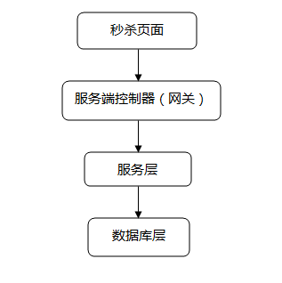

## 面试总结

### 面试岗位

> _后端开发[Golang方向]_

### Golang笔试题解析

> [查看此资料足矣](https://blog.csdn.net/weiyuefei/article/details/77963810)

### 面试题目

#### Golang语言相关

_1.select是随机的还是顺序的？_

> select会`随机`选择一个可用通用做收发操作

_2.Go语言局部变量分配在栈还是堆？_

> Go语言编译器会自动决定把一个变量放在栈还是放在堆，编译器会做`逃逸分析`，当发现变量的作用域没有跑出函数范围，就可以在栈上，反之则必须分配在堆。
>
> [查看资料](https://www.jianshu.com/p/4e3478e9d252)

_3.简述一下你对Go垃圾回收机制的理解？_

> v1.1 STW           
> v1.3 Mark STW, Sweep 并行        
> v1.5 三色标记法         
> v1.8 hybrid write barrier(混合写屏障：优化STW)       
>
> [Golang垃圾回收剖析](http://legendtkl.com/2017/04/28/golang-gc/)

#### DB相关

_1.Mysql事物的隔离级别?_

> | **事务隔离级别**   |  **脏读** | **不可重复读** | **幻读** |
| ----- | ----- | ----- | ----- |
| 读未提交（read-uncommitted） | 是 | 是 | 是 |
| 读已提交（read-committed） | 否 | 是 | 是 |
| 可重复读（repeatable-read） | 否 | 否 | 是 |
| 串行化（serializable） | 否 | 否 | 否 |
>
> [相关资料](https://www.cnblogs.com/huanongying/p/7021555.html)

_2.Innodb和Myisam的区别？_

> Innodb支持事务，而Myisam不支持事务        
> Innodb支持行级锁，而Myisam支持表级锁        
> Innodb支持外键，而Myisam不支持       
> Innodb不支持全文索引，而Myisam支持          
> Innodb是索引组织表， Myisam是堆表
>
> [相关资料](https://blog.csdn.net/nuli888/article/details/52443011)         

_3.Mysql慢响应默认时间?_

> `10s`         

_4.Explain的含义?_

> explain显示了mysql如何使用索引来处理select语句以及连接表。可以帮助
选择更好的索引和写出更优化的查询语句。        

_5.Profile的意义以及使用场景?_

> Profile用来分析SQL性能的消耗分布情况。当用explain无法解决慢SQL的时
候，需要用profile来对SQL进行更细致的分析，找出SQL所花的时间大部分消耗在
哪个部分，确认SQL的性能瓶颈。        

_6.Redis的过期失效机制？_

> `scan`扫描+给每个key存储过期时间戳

_7.Redis持久化方案aof的默认fsync时间是多长？_

> `1s`     

_8.Redis持久化方案rdb和aof的区别？_

> [查看资料](https://juejin.im/post/5ab5f08e518825557f00dfac)

_9.Redis怎么查看延迟数据?（非业务操作）_

> 可以用redis-cli工具加--latency参数可以查看延迟时间

>> `redis-cli --latency -h 127.0.0.1 -p 6379`

> 使用slowlog查出引发延迟的慢命令

>> `slowlog get`       

> 

**10.Redis的集群怎么搭建？**

- [查看资料](https://segmentfault.com/a/1190000008448919)


#### 操作系统相关

**1.Select，Poll，Epoll的区别？**

> `select`，`poll`，`epoll`都是IO多路复用的机制，具体区别请查阅资料   

- [查看资料](https://blog.csdn.net/windeal3203/article/details/52055436)

**2.什么叫虚拟内存？**

> 虚拟内存是计算机系统内存管理的一种技术。它使得应用程序认为它拥有连续的
可用的内存（一个连续完整的地址空间），而实际上，它通常是被分隔成多个物理内
存碎片，还有部分暂时存储在外部磁盘存储器上，在需要时进行数据交换。   

**3.什么叫桥接？**

> 桥接是指依据OSI网络模型的链路层的地址，对网络数据包进行转发的过程，工作
在OSI的第二层；一般的交换机，网桥就有桥接作用。        

**4.Linux什么命令可以查看cpu和内存？怎么查看每个核的cpu呢？**

> top命令        
> 在top查看界面按数字1即可查看每个核的数据        

**5.给一个PID=100你觉得它是后台程序还是前台程序？**

> 进程号0-299保留给daemon进程         

**6.怎么查看一个端口的TCP连接情况？**

> netstat          

**7.Docker的网络模式有哪几种？**

> bridge网络          
> host网络         
> none网络         
> container模式        

**8.介绍一下Tcpdump？**

> tcpdump网络数据包截获分析工具。支持针对网络层、协议、主机、网络或端口
的过滤。并提供and、or、not等逻辑语句帮助去除无用的信息。      

- [查看资料](https://www.cnblogs.com/chyingp/p/linux-command-tcpdump.html)

**什么叫大端和小端？**

> 1.Little-Endian（小端）就是低位字节排放在内存的低地址端，高位字节排放在内存的高地址端        
> 2.Big-Endian（大端）就是高位字节排放在内存的低地址端，低位字节排放在内存的高地址端。

使用场景

> 一般操作系统都是小端的，而通信协议是大端的         

- [查看资料](https://blog.csdn.net/element137/article/details/69091487)

#### 网络相关

**1.http三次握手和四次挥手流程示意图？在黑板上画出**

- [查看资料](https://blog.csdn.net/smileiam/article/details/78226816)

**2.客户端在建立异常中发现很多connect reset by peer,你觉得问题出在哪？**

> 三次握手维护的半连接队列或者全连接队列溢出导致   

- [查看资料](https://mp.weixin.qq.com/s/yH3PzGEFopbpA-jw4MythQ)

**3.https建立连接的过程?** 

  

> 1.客户端发送请求到服务器端     
> 2.服务器端返回证书和公开密钥，公开密钥作为证书的一部分而存在        
> 3.客户端验证证书和公开密钥的有效性，如果有效，则生成对称密钥并使用公开密钥加密发送到服务器端             
> 4.服务器端使用私有密钥解密数据，并使用收到的对称密钥加密数据，发送到客户端       
> 5.客户端使用对称密钥解密数据       
> 6.SSL加密建立………

**4.tcp和udp的区别?**

> 1.TCP面向连接(如打电话要先拨号建立连接);UDP是无连接的，即发送数据之前
不需要建立连接         
> 2.TCP提供可靠的服务。也就是说，通过TCP连接传送的数据，无差错，不丢失，
不重复，且按序到达;UDP尽最大努力交付，即不保证可靠交付          
> 3.TCP面向字节流，实际上是TCP把数据看成一连串无结构的字节流;UDP是面向
报文的，UDP没有拥塞控制，因此网络出现拥塞不会使源主机的发送速率降低    
> 4.每一条TCP连接只能是点到点的;UDP支持一对一，一对多，多对一和多对多的
交互通信        
> 5.TCP首部开销20字节;UDP的首部开销小，只有8个字节        
> 6.TCP的逻辑通信信道是全双工的可靠信道，UDP则是不可靠信道      

**5.http，tcp，ip分别处于OSI哪一层？**

> `传输层协议`：TCP、UDP、SCTP        
> `网络层协议`：IP、ARP、RARP、ICMP、IGMP、OSPF         
> `应用层协议`：http，FTP、SMTP、RIP、DNS       

#### 数据结构相关

**1.什么是跳跃表?**

> 跳跃表是基于有序链表的一种扩展        

- [查看资料](http://blog.jobbole.com/111731/)

#### 分布式架构相关

**1.Etcd满足了CAP原理中哪两个特性？**

> etcd是高可用的键值存储系统。满足CP原理       

**2.Etcd V2和V3版本的区别？**

V2和V3接口不一致，存储不一样，数据互相隔离

> 1.V2是纯内存实现，并未实时将数据写入到磁盘；V3是内存索引(kvindex
: btree) + 后端数据库存储(boltdb: 单机的支持事务的kv存储)       
> 2.V2过期时间只能设置到每个key上，如果多个key要保证生命周期一致则比
较困难；V3过期时间通过lease，可以给每个key设置相同的过期id         
> 3.V2 Watch只能watch某一个key以及子节点(通过参数recursive)，不能
进行多个watch；V3 watch机制支持watch某个固定的key，也支持watch一个范围            
> 4.V2提供http接口；V3通过grpc提供rpc接口       

- [查看资料](http://jolestar.com/etcd-architecture/)

**3.当时选型etcd的考量是啥？和ZK有哪些区别？**

相同点

> 1.应用场景类似: 配置管理，服务注册发现，选主，应用调度，分布式队列，分布式锁。           

不同点

> 1.Etcd使用raft协议;Zk使用paxos协议，前者易于理解，方便工程实现。      
> 2.Etcd相对来说部署方便；Zk的部署、维护、使用比较复杂，需要安装客户端。       
> 3.Etcd提供http+json，grpc接口，跨平台语言; Zk则需要使用其客户端。       
> 4.Etcd支持https访问; Zk在这方面缺失。        

**4.服务治理包含哪些？**

> `服务注册和发现`         
> `服务监控`         
> `集群容错`       
> `负载均衡`         

**5.负载均衡分类？**

> 1.DNS负载均衡(地理负载均衡)         
> 2.硬件负载均衡(F5和A10,能支撑200万-800万/秒并发，价格昂贵)           
> 3.软件负载均衡(Nginx和Lvs,nginx支撑5万/秒，LVS支撑80万/秒，价格便宜，
扩展方便)

并发访问量大于1000万时可以考虑配合使用


**6.Nginx和Lvs的区别？**

> 1.Nginx工作在第7层，网络的依赖比较小，可以对HTTP应用实施分流策略，比如域名、结构等；Lvs工作在第4层，比较依赖网络环境，可以对几乎所有应用进行负载均衡，包括Web、数据库等          
> 2.Nginx负载能力强，因为其工作方式逻辑非常简单，仅进行请求分发，没有
流量；Lvs负载能力较差，受限于机器的I/O配置(处理流量)        
> 3.Nginx安装，配置及测试相对简单；Lvs的安装、配置及测试所花的时间比较长

- [参考资料](https://blog.csdn.net/barnetthe/article/details/48784233)

#### 设计和算法相关

**1.要设计一个秒杀系统要注意什么？**



前端秒杀页面

> `页面静态化`：将活动页面上的所有可以静态的元素全部静态化，并尽量减少动态
元素。通过CDN来抗峰值。              
> `禁止重复提交`：用户提交之后按钮置灰，禁止重复提交。         
> `用户限流`：在某一时间段内只允许用户提交一次请求，比如可以采取IP限流。              

服务端控制器(网关)

> `限制uid访问频率`：我们上面拦截了浏览器访问的请求，但针对某些恶意攻击或其它插件，在服务端控制层需要针对同一个访问uid，限制访问频率。                   

服务层

> `采用消息队列缓存请求`：既然服务层知道库存只有100台手机，那完全没有必要把100W个请求都传递到数据库啊，那么可以先把这些请求都写到消息队列缓存一下，数据库层订阅消息减库存，减库存成功的请求返回秒杀成功，失败的返回秒杀结束。      
> `利用缓存应对读请求`：对类似于12306等购票业务，是典型的读多写少业务，大部分请求是查询请求，所以可以利用缓存分担数据库压力。      
> `利用缓存应对写请求`：缓存也是可以应对写请求的，比如我们就可以把数据库中的库存数据转移到Redis缓存中，所有减库存操作都在Redis中进行，然后再通过后台进程把Redis中的用户秒杀请求同步到数据库中。           

数据库层

> 数据库层是最脆弱的一层，一般在应用设计时在上游就需要把请求拦截掉，数据库层只承担“能力范围内”的访问请求。所以，上面通过在服务层引入队列和缓存，让最底层的数据库高枕无忧。       

**2.要设计一个类似微信红包架构系统要注意什么？**

> `南北分区`        
> `快慢分离`       
> `Hash负载均衡`         
> `Cache屏蔽DB`          
> `双维度分库表`              

[查看资料](https://blog.csdn.net/starsliu/article/details/51134473)

**3.如何在一个给定有序数组中找两个和为某个定值的数，要求时间复杂度为O(n),
比如给｛1，2，4，5，8，11，15｝和15？**

```Golang
func Lookup(meta []int32, target int32) {
	left := 0
	right := len(meta) - 1
	for i := 0; i < len(meta); i++ {
		if meta[left]+meta[right] > target {
			right--
		} else if meta[left]+meta[right] < target {
			left++
		} else {
			fmt.Println(fmt.Sprintf("%d, %d", meta[left], meta[right]))
			return
		}
	}
	fmt.Println("未找到匹配数据")
}
```

**4.给定一个数组代表股票每天的价格，请问只能买卖一次的情况下，最大化利润是多少？日期不重叠的情况下，可以买卖多次呢？输入：{100,80,120,130,70,60,100,125}，只能买一次：65(60买进，125卖出)；可以买卖多次：115(80买进，130卖出；60买进，125卖出)？**

```Golang
func main() {
	a := []int{100, 80, 120, 130, 70, 60, 100, 125}
	// a := []int{68, 0, 1, 67}
	var buyPrice, salePrice = 1<<31 - 1, -1 << 31
	var buyDay, saleDay = -1, -1

	type Op struct {
		BuyDay, SaleDay     int
		BuyPrice, SalePrice int
		Earnings            int
	}
	var opList = []Op{}

	// 遇到的第一个波谷买入，下一个波峰卖出，可以获取最大收益
	for k, todayPrice := range a {
		if buyDay == -1 {
			// 寻找买入点
			if todayPrice < buyPrice {
				buyPrice = todayPrice
				continue
			}
			// 买入
			buyDay = k - 1
			continue
		}
		// 寻找卖出点
		if todayPrice > salePrice {
			salePrice = todayPrice
			if k < len(a)-1 {
				continue
			}
		}
		// 卖出
		if k < len(a)-1 {
			saleDay = k - 1
		} else {
			saleDay = k
		}
		opList = append(opList, Op{
			BuyDay:    buyDay,
			SaleDay:   saleDay,
			BuyPrice:  buyPrice,
			SalePrice: salePrice,
			Earnings:  salePrice - buyPrice,
		})
		// 重复下一轮操作
		buyPrice, salePrice = 1<<31-1, -1<<31
		buyDay, saleDay = -1, -1
	}
	fmt.Printf("%+v", opList)
}
```

**5.给40亿个不重复的unsigned int的整数，没排过序的，然后再给一个数，如何快速判断这个数是否在那40亿个数当中？**

在这里只分享思路

```
	首先，40亿个unsigned int的整数，如果放到内存，那就是大约16G的空间，
那么直接放到内存空间进行排序然后二分查找的方式是行不通的。
```

方案一

```
	 在这里可以考虑使用bitmap，需要4*10^9bit内存， 大约500MB就可一把40
亿的数全部进行hash，时间复杂度是O（n），然后可以在O(1)的时间内进行判断此
数是否在40亿中；此过程在内存中完成。
```

方案二

```
	考虑在磁盘中操作。
	因为2^32为40亿多，所以给定一个数可能在，也可能不在其中；这里我们把40亿
个数中的每一个用32位的二进制来表示，假设这40亿个数开始放在一个文件中。
	然后将这40亿个数分成两类:
      1.最高位为0
      2.最高位为1
  并将这两类分别写入到两个文件中；
  再然后把这两个文件为又分成两类:
      1.次最高位为0
      2.次最高位为1
  ...
  以此类推就可以找到了,而且时间复杂度为O(logn)
```